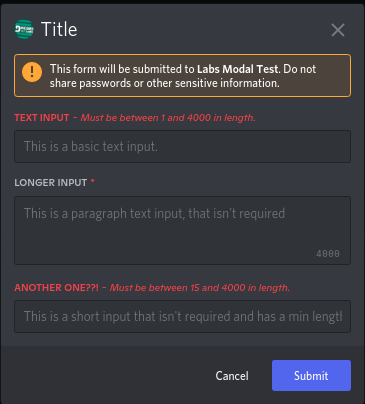
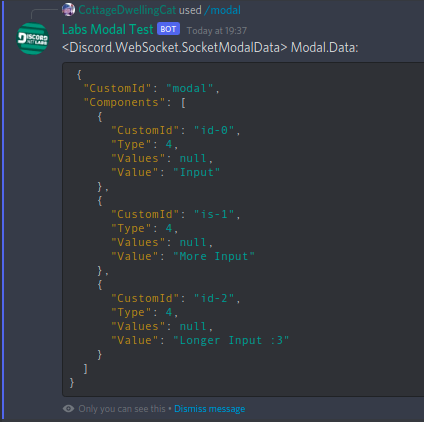
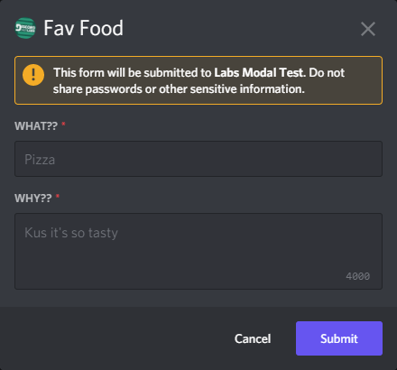

# Modals

> [!WARNING]
> Modals are currently not supported on Android.

## Getting started with modals
This guide will show you how to use modals and give a few examples of
valid use cases. If your question is not covered by this guide ask in the
[Discord.Net Discord Server](https://discord.gg/dnet).

### What is a modal?
Modals are forms bots can send when responding to interactions. Modals 
are sent to Discord as an array of message components and converted 
into the form layout by user's clients. Modals are required to have a
custom id, title, and at least one component. 



When users submit modals, your client fires the ModalSubmitted event. 
You can get the components of the modal from the `Data.Components` property
on the SocketModal:

 

### Using modals

Lets create a simple modal with an entry field for users to
tell us their favorite food. We can start by creating a slash
command that will respond with the modal.
```cs
[SlashCommand("food", "Tell us about your favorite food!")]
public async Task FoodPreference()
{
    // send a modal
}
```

Now that we have our command setup we need to build a modal.
We can use the aptly named `ModalBuilder` for that:

| Method          | Description                               |
| --------------- | ----------------------------------------- |
| `WithTitle`     | Sets the modal's title.                   |
| `WithCustomId`  | Sets the modal's custom id.               |
| `AddTextInput`  | Adds a `TextInputBuilder` to the modal.   |
| `AddComponents` | Adds multiple components to the modal.    |
| `Build`         | Builds the `ModalBuilder` into a `Modal`. |

We know we need to add a text input to the modal, so let's look at that
method's parameters.

| Parameter     | Description                                |
| ------------- | ------------------------------------------ |
| `label`       | Sets the input's label.                    |
| `customId`    | Sets the input's custom id.                |
| `style`       | Sets the input's style.                    |
| `placeholder` | Sets the input's placeholder.              |
| `minLength`   | Sets the minimum input length.             |
| `maxLength`   | Sets the maximum input length.             |
| `required`    | Sets whether or not the modal is required. |
| `value`       | Sets the input's default value.            |

To make a basic text input we would only need to set the `label` and
`customId`, but in this example we will also use the `placeholder` 
parameter. Next we can build our modal:

```cs
var mb = new ModalBuilder()
    .WithTitle("Fav Food")
    .WithCustomId("food_menu")
    .AddTextInput("What??", "food_name", placeholder:"Pizza")
    .AddTextInput("Why??", "food_reason", TextInputStyle.Paragraph, 
        "Kus it's so tasty");
```

Now that we have a ModalBuilder we can update our command to respond
with the modal.

```cs
[SlashCommand("food", "Tell us about your favorite food!")]
public async Task FoodPreference()
{
    var mb = new ModalBuilder()
    .WithTitle("Fav Food")
    .WithCustomId("food_menu")
    .AddTextInput("What??", "food_name", placeholder:"Pizza")
    .AddTextInput("Why??", "food_reason", TextInputStyle.Paragraph, 
        "Kus it's so tasty");
    
    await Context.Interaction.RespondWithModalAsync(mb.Build());
}
```

When we run the command our modal should pop up:

 

### Respond to modals

> [!WARNING]
> Modals can not be sent when respoding to a modal.

Once a user has submitted our modal we need to let everyone know what
their favorite food is. We can start by hooking a task to the clients
`ModalSubmitted` event.
```cs
_client.ModalSubmitted += async modal =>
{
    // Get the values of components.
    List<SocketMessageComponentData> components =
        modal.Data.Components.ToList();
    string food = components
        .Where(x => x.CustomId == "food_name").First().Value;
    string reason = components
        .Where(x => x.CustomId == "food_reason").First().Value;

    // Build the message to send.
    string message = "hey @everyone; I just learned " + 
        $"{modal.User.Mention}'s favorite food is " +
        $"{food} because {reason}.";

    // Specify the AllowedMentions so we don't actually ping everyone.
    AllowedMentions mentions = new AllowedMentions();
    mentions.AllowedTypes = AllowedMentionTypes.Users;

    // Respond to the modal.
    await modal.RespondAsync(message, allowedMentions:mentions);
}
```

Now responding to the modal should inform everyone of our tasty 
choices.

